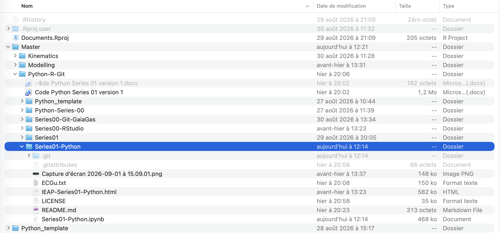

# Git-Series-00

## Introduction

This repository is used to learn by doing the basics of Git and GitHub.

Before doing the preparatory work for this master's degree, I had never used Git and GitHub. 

I look forward to learn more about Git and GitHub. 

## Add a pretty image  

## My motivation to learn Python, R and Git

The last time I used Python was during my math final exam. It was a multiple-choice question and I got it wrong. I want to learn Python to take revenge for that lost point. Regarding R, my dad learnt how to use it and he keeps telling me that I should learn it because it can do "anything". It would be really cool to send him a nice thing coded with R one day. As for Git, it will keep my projects organized. Learning Python, R and Git will be a really important part of my Master's degree. 

## Add a local image
     

